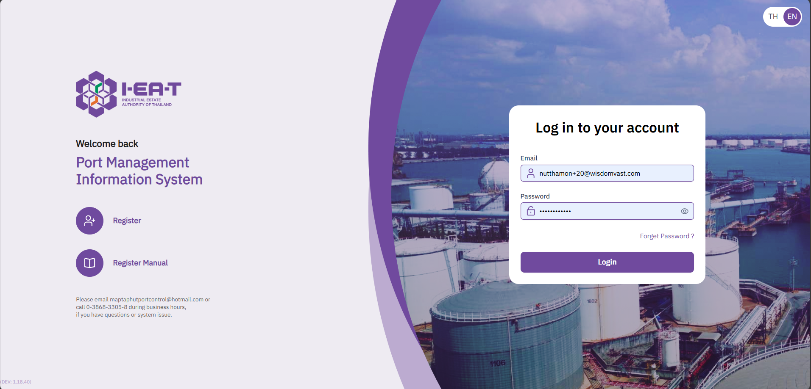
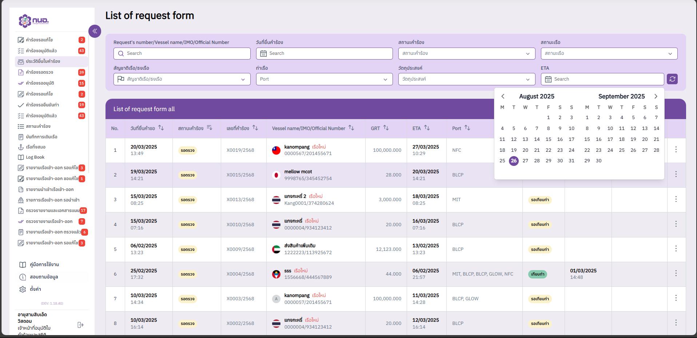

# Port Management Information System (PMIS) Upgrade

A modernized **Port Management Information System (PMIS)** with integrated **Content Management System (CMS)**, built with Nuxt 3 and Vue 3.  
This project helps streamline **port operations, vessel scheduling, reporting, and administration**, while offering multilingual support and a user-friendly interface.

---

<p align="center">
  <a href="https://raw.githubusercontent.com/nithasp/pmis-upgrade/master/screenshots/screenshot1.png" target="_blank">
    
  </a>
  <a href="https://raw.githubusercontent.com/nithasp/pmis-upgrade/master/screenshots/screenshot3.png" target="_blank">
    
  </a>
</p>

---

## 🚀 Features

-  Vessel scheduling and port operations management
-  Interactive **dashboards and charts** (Chart.js)
-  **Map integration** with Leaflet for port visualization
-  **Multilingual support** (nuxt-i18n)
-  **PDF and report generation** (jsPDF + Autotable)
-  CMS features for content and document management
-  Modern responsive UI with **Nuxt UI + Tailwind CSS**
-  Date & time pickers (V-Calendar)

---

## 🛠 Tech Stack

-  **Frontend Framework**: Nuxt 3, Vue 3, TypeScript
-  **State Management**: Pinia
-  **UI & Styling**: Nuxt UI, Tailwind CSS, Sass
-  **APIs**: Axios
-  **Localization**: nuxt-i18n
-  **Visualization**: Chart.js, Leaflet
-  **Reports & Export**: jsPDF, jsPDF-Autotable
-  **Utilities**: Moment.js, Date-fns, AutoNumeric

---

## 📦 Installation

```bash
# Clone the repository
git clone https://github.com/your-username/pmis-upgrade.git

# Navigate into the project folder
cd pmis-upgrade

# Install dependencies
npm install

# Run development server
npm run dev
```
